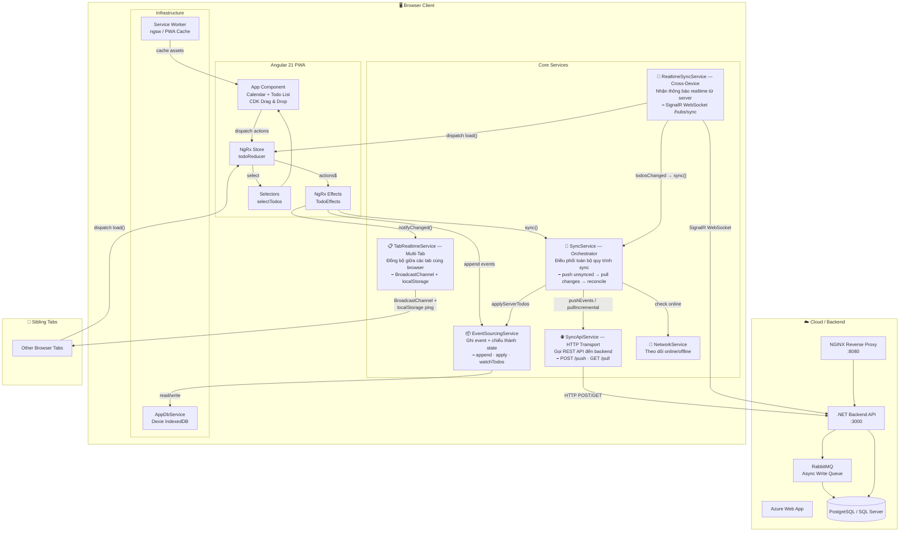
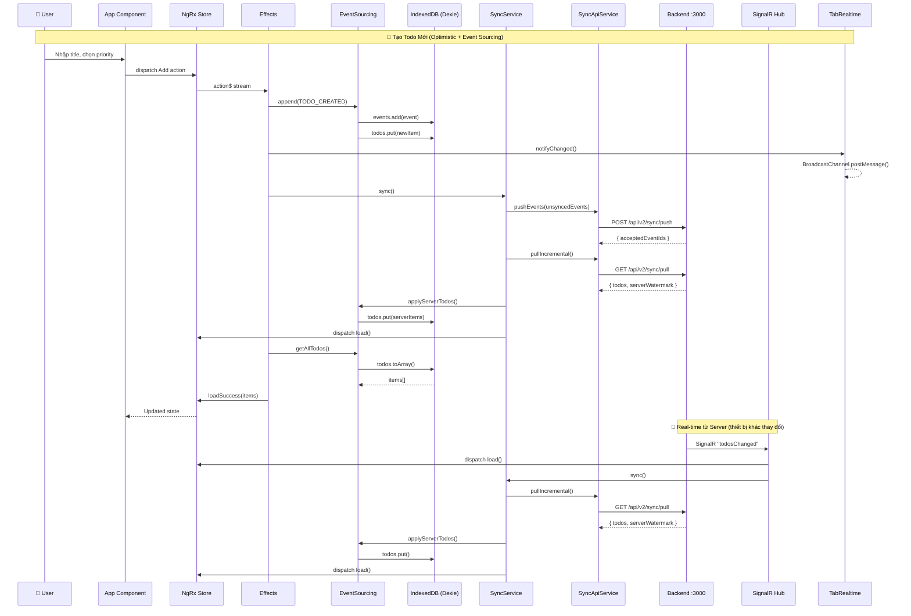

# Todolist Frontend

Ứng dụng Todo theo hướng **offline-first**, đồng bộ realtime giữa nhiều trình duyệt/thiết bị.

## I. Tech stack

### Frontend
- **Angular 21** (standalone components)
- **TypeScript 5.9**
- **NgRx** (`@ngrx/store`, `@ngrx/effects`) cho luồng action/effect
- **RxJS** cho stream dữ liệu UI/sync
- **Dexie (IndexedDB)** cho local database (offline-first)
- **Angular CDK DragDrop** cho kéo-thả sắp xếp task
- **SignalR client** (`@microsoft/signalr`) cho realtime sync event
- **Angular Service Worker (PWA)** cho offline cache

### Backend (repo riêng)
- **ASP.NET Core** (Minimal API)
- **SignalR Hub**
- Event store in-memory + persist file (`App_Data/state.json`)

## II. Kỹ Thuật & Design Patterns

### 1. Event Sourcing
> **File:** [event-sourcing.service.ts](file:///d:/GitHub/todolist/src/app/core/services/event-sourcing.service.ts)

- Mọi thay đổi ghi thành **event** (`TODO_CREATED`, `TODO_TOGGLED`, `TODO_RENAMED`, `TODO_REORDERED`, `TODO_DELETED`)
- Event lưu vào bảng `events` (IndexedDB) → apply projection vào bảng `todos`
- Events chưa sync được đánh dấu `synced: 0`, push lên server khi có mạng

**Ưu điểm:** Audit trail, offline queue, conflict detection
**Nhược điểm:** Storage tăng dần (cần purge events cũ), phức tạp hơn CRUD đơn giản

### 2. CQRS (Command Query Responsibility Segregation)
> **File:** [sync-api.service.ts](file:///d:/GitHub/todolist/src/app/core/services/sync-api.service.ts)

- **Write path:** `POST /api/v2/sync/push` — đẩy events lên server
- **Read path:** `GET /api/v2/sync/pull` — kéo thay đổi về (phân trang + watermark)
- Tách biệt hoàn toàn giữa ghi và đọc

### 3. Optimistic UI
> **File:** [todo.effects.ts](file:///d:/GitHub/todolist/src/app/state/todo.effects.ts)

- UI cập nhật **ngay lập tức** khi user thao tác (ghi vào IndexedDB local)
- Sync với server chạy **background** — không block UI
- Nếu server reject → cần rollback (hiện chưa implement)

### 4. Offline-First
> **Files:** [app-db.service.ts](file:///d:/GitHub/todolist/src/app/infrastructure/db/app-db.service.ts), [sync.service.ts](file:///d:/GitHub/todolist/src/app/core/services/sync.service.ts)

- Dữ liệu lưu trong IndexedDB — app hoạt động không cần mạng
- Events queue lại khi offline, tự push khi online trở lại
- Service Worker cache assets cho PWA
- `window.addEventListener('online')` trigger sync ngay khi có mạng

### 5. Incremental Sync với Watermark
> **File:** [sync.service.ts](file:///d:/GitHub/todolist/src/app/core/services/sync.service.ts)

- Dùng `lastChangeId` (UUID watermark) để biết đã sync đến đâu
- Pull phân trang (`limit: 300`, có `cursor`) — không tải toàn bộ DB
- Full sync reconciliation: so sánh local vs server, xóa bản ghi stale
- Sync version check (`SYNC_VERSION = '2'`) — force reset khi schema đổi

### 6. Dual Store (NgRx + Dexie)
> **Files:** `state/*.ts` + `infrastructure/db/app-db.service.ts`

- **Dexie** = source of truth (disk, persist)
- **NgRx Store** = read cache (RAM, mất khi refresh)
- Data flow: Dexie → `getAllTodos()` → `dispatch(loadSuccess)` → NgRx → UI

> [!WARNING]
> **Hai kho chứa cùng dữ liệu** — phải dispatch `load()` thủ công ở nhiều nơi để đồng bộ. `liveQuery` đã viết sẵn nhưng chưa dùng — nếu dùng có thể bỏ NgRx, giảm phức tạp đáng kể.

### 7. Multi-tab Sync
> **File:** [tab-realtime.service.ts](file:///d:/GitHub/todolist/src/app/core/services/tab-realtime.service.ts)

- `BroadcastChannel('todo-sync-channel')` — API chuẩn browser, nhanh
- Fallback: `localStorage` event cho browser không hỗ trợ
- Khi 1 tab thay đổi → broadcast → các tab khác dispatch `load()`

### 8. Real-time Cross-Device
> **File:** [realtime-sync.service.ts](file:///d:/GitHub/todolist/src/app/core/services/realtime-sync.service.ts)

- SignalR Hub tại `/hubs/sync`
- Auto-reconnect: `[0, 1000, 3000, 5000]ms`
- Khi nhận `'todosChanged'` → trigger full sync
- Fallback retry mỗi 5 giây khi connection đứt

## III.Tổng Quan Hệ Thống



## Luồng Dữ Liệu Chi Tiết



## IV. Cấu Trúc Thư Mục

```
todolist/
├── src/app/
│   ├── app.ts                    # Root component (Calendar + TodoList UI)
│   ├── app.html / app.scss       # Template & styles
│   ├── app.config.ts             # Angular providers (NgRx, HttpClient, SW)
│   ├── app.routes.ts             # Router config
│   ├── core/
│   │   ├── models/
│   │   │   └── todo.model.ts     # TodoItem, TodoEvent, TodoPriority
│   │   └── services/
│   │       ├── event-sourcing.service.ts  # Event store + projection
│   │       ├── sync.service.ts            # Push/Pull orchestrator  
│   │       ├── sync-api.service.ts        # HTTP client for /api/v2/sync
│   │       ├── realtime-sync.service.ts   # SignalR connection
│   │       ├── network.service.ts         # Online/Offline detection
│   │       └── tab-realtime.service.ts    # Multi-tab sync
│   ├── infrastructure/
│   │   └── db/
│   │       └── app-db.service.ts  # Dexie IndexedDB (3 tables)
│   └── state/
│       ├── todo.actions.ts        # NgRx actions (Load, Add, Toggle, ...)
│       ├── todo.effects.ts        # Side-effects orchestration
│       ├── todo.reducer.ts        # State reducer
│       └── todo.selectors.ts      # Memoized selectors
├── .github/workflows/
│   ├── azure-webapps-node.yml     # CI/CD → Azure Web App
│   └── webpack.yml                # Build check
├── load-tests/
│   └── stress-test.js             # k6 stress test (20K CCU)
└── proxy.conf.json                # Dev proxy → localhost:3000
```
