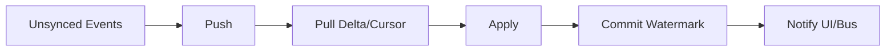
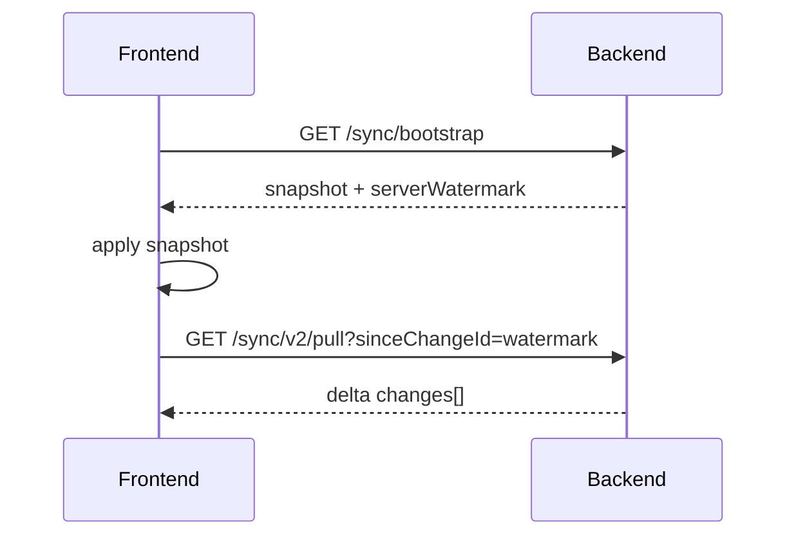
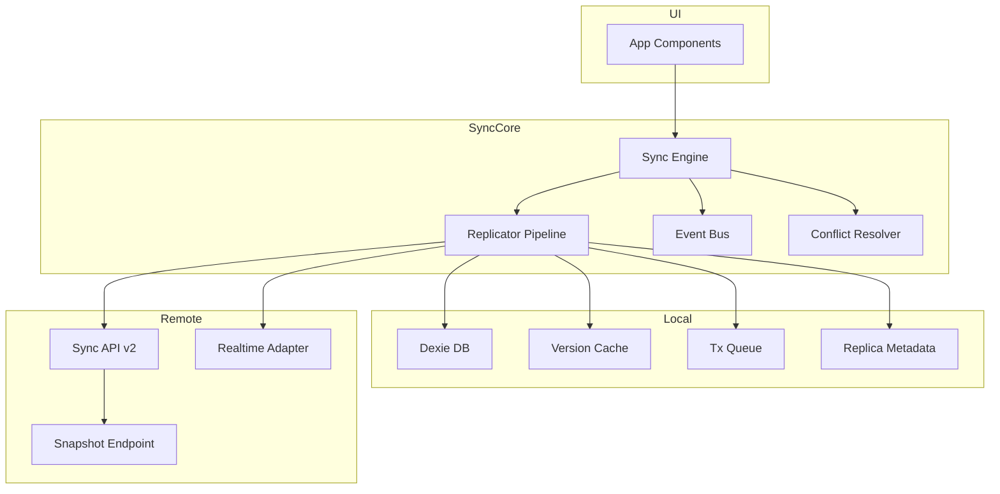

# Upgrade Blueprint: Sync Architecture for TodoList Frontend

> Tài liệu này mô tả các hạng mục nâng cấp kiến trúc đồng bộ để ứng dụng vận hành ổn định với dữ liệu lớn, dễ mở rộng, dễ vận hành production.

---

## 1) Mục tiêu nâng cấp

### Mục tiêu kỹ thuật
- Đồng bộ mượt với dữ liệu lớn (10k+ records), không pull full liên tục.
- Mở rộng thêm entity mới mà không phải sửa core sync nhiều lần.
- Có khả năng quan sát, retry, replay và xử lý lỗi rõ ràng.
- Duy trì backward compatibility trong giai đoạn chuyển đổi.

### Mục tiêu vận hành
- Giảm timeout và lag khi tải tăng.
- Giảm bug race condition/conflict khó tái hiện.
- Dễ debug theo từng client/replica.

---

## 2) Hiện trạng đã có

- Đã có nền offline local DB (Dexie) + event-based sync cơ bản.
- Đã có realtime trigger và đồng bộ theo chu kỳ sự kiện.
- Đã có nâng cấp bước đầu: incremental pull theo `sinceChangeId + cursor` (v2) và fallback v1.

---

## 3) Khoảng trống còn thiếu & đề xuất nâng cấp

## 3.1 Replica Metadata Layer
**Thiếu:** Chưa quản lý trạng thái sync theo từng client/device.

**Bổ sung:**
- `ReplicaState` (replicaId, lastWatermark, lastSeenAt, appVersion, features)
- Repository riêng để track health sync theo thiết bị.

**Lợi ích:** Debug “máy nào thiếu dữ liệu” chính xác, rollout theo nhóm client dễ hơn.

---

## 3.2 Replicator Pipeline tách riêng
**Thiếu:** Sync logic còn dính với service chung.

**Bổ sung:** Tách pipeline chuẩn:
1. Push unsynced local events
2. Pull delta by cursor
3. Apply changes
4. Commit watermark

**Lợi ích:** Dễ test, dễ bảo trì, dễ thay transport.

---

## 3.3 Event Bus Abstraction
**Thiếu:** Module còn coupling trực tiếp.

**Bổ sung:** `EventBus` + subscription manager nội bộ.

**Lợi ích:** Tách sync core khỏi toast/log/telemetry/UI reactions.

---

## 3.4 Snapshot Bootstrap
**Thiếu:** First load dữ liệu lớn chưa có cơ chế snapshot chuẩn.

**Bổ sung:**
- Endpoint snapshot nhẹ (`/sync/bootstrap`)
- Sau snapshot mới pull incremental.

**Lợi ích:** Warm-up nhanh hơn đáng kể, giảm số request ban đầu.

---

## 3.5 Version Cache đa tầng
**Thiếu:** Watermark cache chưa đủ robust khi reload/crash.

**Bổ sung:** cache policy 3 tầng:
- memory
- IndexedDB
- localStorage fallback

**Lợi ích:** recover nhanh, giảm pull thừa.

---

## 3.6 Transaction Queue
**Thiếu:** Dễ đua ghi khi realtime + online event + user action cùng lúc.

**Bổ sung:** queue serialize transaction sync local.

**Lợi ích:** Tránh race condition, giữ thứ tự apply ổn định.

---

## 3.7 Scope Sync (hot/cold partition)
**Thiếu:** Chưa tách dữ liệu nóng/lạnh.

**Bổ sung:** sync theo scope:
- 30/90 ngày gần nhất trước
- dữ liệu cũ lazy-load khi mở vùng tương ứng

**Lợi ích:** giảm payload và thời gian sync trung bình.

---

## 3.8 Realtime Adapter Abstraction
**Thiếu:** Phụ thuộc một kiểu realtime transport.

**Bổ sung:** `RealtimeAdapter` interface để cắm nhiều transport backend.

**Lợi ích:** linh hoạt khi scale hoặc đổi hạ tầng.

---

## 3.9 Conflict Resolution Policy
**Thiếu:** Conflict policy còn đơn giản.

**Bổ sung:** conflict matrix theo entity/field:
- LWW
- merge rule
- manual resolution (nếu cần)

**Lợi ích:** tránh ghi đè sai dữ liệu nghiệp vụ.

---

## 3.10 Observability chuẩn production
**Thiếu:** Chưa có bộ metric sync đầy đủ.

**Bổ sung metrics:**
- `sync.duration_ms`
- `sync.pull.batch_count`
- `sync.pull.items_applied`
- `sync.retry.count`
- `sync.conflict.count`
- `sync.watermark.lag`

**Lợi ích:** phát hiện sớm bottleneck/lỗi sync.

---

## 4) Kiến trúc mục tiêu tổng thể

---

## 5) Kế hoạch triển khai đề xuất

## Phase 1 (P0 - bắt buộc)
1. Hoàn thiện replicator pipeline + replica metadata.
2. Bổ sung transaction queue cho apply path.
3. Cố định incremental pull + cursor + watermark commit.
4. Bổ sung metrics cốt lõi.

## Phase 2 (P1)
5. Snapshot bootstrap.
6. Scope sync (hot/cold).
7. Conflict policy matrix bản đầu.

## Phase 3 (P2)
8. Realtime adapter abstraction.
9. Background sync nâng cao.
10. Multi-entity plugin handlers đầy đủ.

---

## 6) Tiêu chí nghiệm thu

- [ ] Không còn full pull trong steady-state.
- [ ] Sync 10k records trong ngưỡng thời gian chấp nhận.
- [ ] Không race condition khi nhiều trigger đồng thời.
- [ ] Có dashboard + alert cho sync health.
- [ ] Thêm entity mới không sửa core engine.

---

## 7) Rủi ro và trade-off

### Trade-off
- Tăng độ phức tạp hệ thống (nhiều lớp hơn).
- Tăng effort test/monitoring.
- Cần kỷ luật code và contract event chặt hơn.

### Cách giảm rủi ro
- Rollout theo phase + feature flag.
- Contract test giữa frontend/backend cho sync DTO.
- Load test định kỳ theo data size thực tế.

---

## 8) Kết luận

Nâng cấp theo blueprint này giúp TodoList Frontend đi từ mức “sync dùng được” lên mức “sync production-scale”, đủ nền để mở rộng dài hạn mà không phải refactor lớn lặp đi lặp lại.
