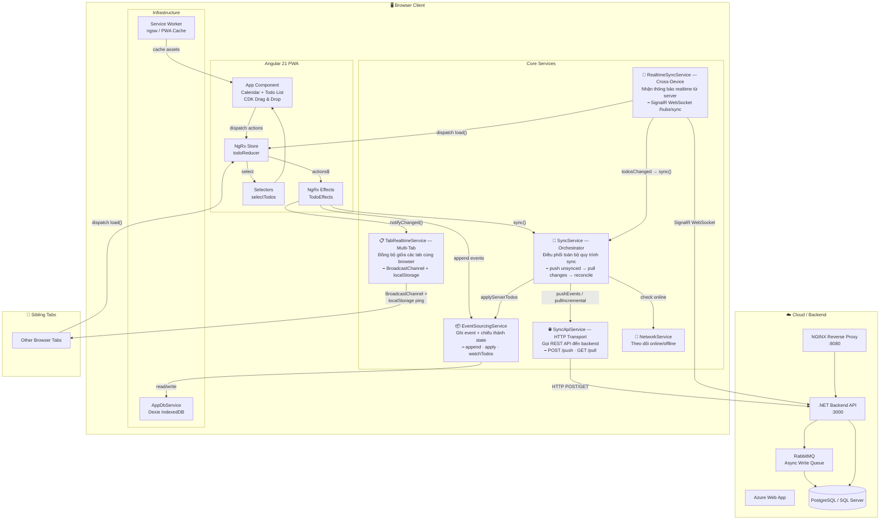
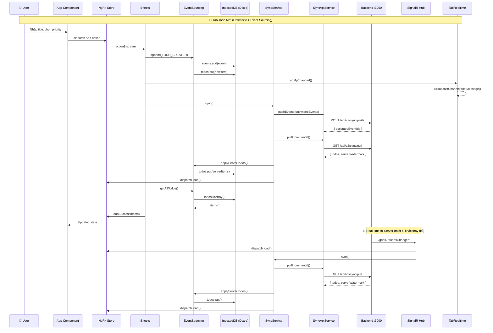

# 🏗️ Sơ Đồ Kiến Trúc — TodoSync Frontend

## Tổng Quan Hệ Thống



## Luồng Dữ Liệu Chi Tiết



## Cấu Trúc Thư Mục

```
todolist/
├── src/app/
│   ├── app.ts                    # Root component (Calendar + TodoList UI)
│   ├── app.html / app.scss       # Template & styles
│   ├── app.config.ts             # Angular providers (NgRx, HttpClient, SW)
│   ├── app.routes.ts             # Router config
│   ├── core/
│   │   ├── models/
│   │   │   └── todo.model.ts     # TodoItem, TodoEvent, TodoPriority
│   │   └── services/
│   │       ├── event-sourcing.service.ts  # Event store + projection
│   │       ├── sync.service.ts            # Push/Pull orchestrator  
│   │       ├── sync-api.service.ts        # HTTP client for /api/v2/sync
│   │       ├── realtime-sync.service.ts   # SignalR connection
│   │       ├── network.service.ts         # Online/Offline detection
│   │       └── tab-realtime.service.ts    # Multi-tab sync
│   ├── infrastructure/
│   │   └── db/
│   │       └── app-db.service.ts  # Dexie IndexedDB (3 tables)
│   └── state/
│       ├── todo.actions.ts        # NgRx actions (Load, Add, Toggle, ...)
│       ├── todo.effects.ts        # Side-effects orchestration
│       ├── todo.reducer.ts        # State reducer
│       └── todo.selectors.ts      # Memoized selectors
├── .github/workflows/
│   ├── azure-webapps-node.yml     # CI/CD → Azure Web App
│   └── webpack.yml                # Build check
├── load-tests/
│   └── stress-test.js             # k6 stress test (20K CCU)
└── proxy.conf.json                # Dev proxy → localhost:3000
```

## Các Design Pattern Chính

| Pattern | Vị trí | Mô tả |
|---------|--------|-------|
| **Event Sourcing** | `EventSourcingService` | Mọi thay đổi được ghi dưới dạng event → project ra state |
| **CQRS** | `SyncService` | Push (write) và Pull (read) tách biệt qua API v2 |
| **Offline-First** | `Dexie + IndexedDB` | Dữ liệu lưu local, sync khi có mạng |
| **Optimistic UI** | `TodoEffects` | UI cập nhật ngay, sync background |
| **Redux/NgRx** | `state/` | Single source of truth cho UI rendering |
| **Real-time Sync** | `SignalR Hub` | Server push notifications khi data thay đổi |
| **Multi-tab Sync** | `BroadcastChannel` | Đồng bộ giữa các tab cùng browser |
| **PWA** | `Service Worker` | Cache assets, hoạt động offline |

## Tech Stack

| Layer | Technology | Version |
|-------|-----------|---------|
| Framework | Angular | 21.2 |
| State Management | NgRx (Store + Effects) | 21.0 |
| Offline DB | Dexie (IndexedDB) | 4.3 |
| Real-time | SignalR | 10.0 |
| Drag & Drop | Angular CDK | 21.2 |
| PWA | Angular Service Worker | 21.2 |
| Testing | Vitest | 4.0 |
| Load Testing | k6 | - |
| CI/CD | GitHub Actions → Azure | - |
| Backend | .NET + RabbitMQ + NGINX | - |
