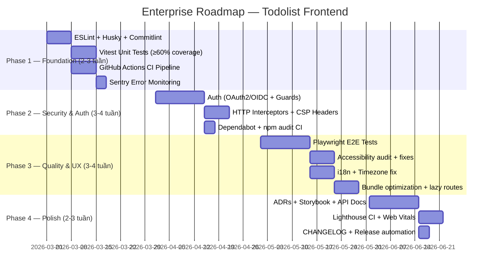

# 🏢 Enterprise-Level Gap Analysis & Roadmap
## Dự án: Todolist Frontend (Angular 21 + NgRx + SignalR + Offline-First)

---

## 📊 Đánh giá tổng quan

Dự án có **nền tảng kiến trúc rất tốt** — offline-first với event sourcing, realtime sync qua SignalR, state management với NgRx, PWA. Đây là những pattern mà phần lớn team doanh nghiệp phải mất nhiều năm mới đạt được. Tuy nhiên, để trở thành **showcase cấp global enterprise**, còn 10 trụ cột chưa được phủ:

---

## 🔍 Gap Analysis — 10 Trụ Cột Còn Thiếu

### 1. 🧪 Testing Strategy (Hiện trạng: ~0%)

| Chiều | Current | Target |
|---|---|---|
| Unit Test | [app.spec.ts](file:///d:/GitHub/todolist/src/app/app.spec.ts) rỗng; `vitest` cài nhưng chưa dùng | ≥ 80% coverage |
| Integration Test | Không có | Services → IndexedDB |
| E2E Test | Không có | Playwright full flows |
| Sync/Conflict Test | Không có | Multi-tab, offline → online |

**Tools bổ sung:** `Playwright`, `@testing-library/angular`, `vitest` (đã có), MSW (mock service worker)

---

### 2. 🚀 CI/CD Pipeline (Hiện trạng: Không có)

Hiện không có file `.github/workflows/`, không có pipeline tự động nào.

**Cần bổ sung:**
- GitHub Actions pipeline: lint → test → build → deploy
- Branch protection rules (PRs require passing CI)
- Lighthouse CI — audit performance/PWA score tự động mỗi PR
- Automatic preview deployments (Vercel/Netlify per-PR)
- Release automation với `semantic-release` hoặc `changesets`

---

### 3. 🔐 Authentication & Authorization (Hiện trạng: Không có)

Backend hiện là anonymous, frontend không có auth flow.

**Cần bổ sung:**
- Auth layer: OAuth2/OIDC (PKCE flow) — tích hợp `angular-oauth2-oidc` hoặc Auth0
- HTTP interceptor inject Bearer token
- Route guards (`canActivate`) cho các protected routes
- Refresh token rotation + silent renew
- Multi-user isolation trong IndexedDB (namespace per user)
- RBAC foundation (role-based access control) — dù chỉ là `owner` role hiện tại

---

### 4. 🛡️ Security Best Practices (Hiện trạng: Cơ bản)

**Đang thiếu:**
- `Content-Security-Policy` headers (qua meta tag hoặc server)
- `Subresource Integrity` nếu dùng CDN
- `npm audit` integration trong CI
- Secret scanning (`.env` không bị commit)
- Dependency update bot: `Dependabot` hoặc `Renovate`
- Rate limiting awareness (bên frontend nên có logic retry exponential backoff)

---

### 5. 📈 Observability & Error Monitoring (Hiện trạng: Không có)

Hiện `catch {}` bỏ qua lỗi hoàn toàn — không có gì để debug production.

**Cần bổ sung:**
- **Error tracking:** Sentry Angular SDK — tự động báo uncaught errors + source maps
- **Performance monitoring:** Web Vitals (CLS, LCP, FID) đo lường và report
- **Logging layer:** structured log service thay cho `console.log/error` rải rác
- **Sync telemetry:** track số events synced/failed, latency, conflict rate
- **Custom NgRx Meta-Reducer** để log action/state transitions (debug-friendly)

---

### 6. ♿ Accessibility / a11y (Hiện trạng: Không biết)

**Cần bổ sung:**
- ARIA labels cho interactive elements (todo items, drag handles)
- Keyboard navigation hoàn chỉnh (drag & drop bằng keyboard)
- Focus management sau các operations
- `axe-core` integration trong test suite hoặc CI
- Color contrast audit (WCAG AA minimum)

**Tools:** `@axe-core/playwright`, `eslint-plugin-jsx-a11y` (dùng cho Angular tương đương)

---

### 7. ⚡ Performance & Bundle Optimization (Hiện trạng: Cơ bản)

**Đang thiếu:**
- **Lazy loading routes** — hiện [app.routes.ts](file:///d:/GitHub/todolist/src/app/app.routes.ts) chỉ có `[]` rỗng, chưa có route nào
- **Bundle analysis:** `source-map-explorer` hoặc `webpack-bundle-analyzer`
- **Virtual scrolling** nếu danh sách todo lớn (`@angular/cdk/scrolling`)
- **Preload strategy** cho Service Worker (cấu hình [ngsw-config.json](file:///d:/GitHub/todolist/ngsw-config.json) hiện rất minimal)
- **Dexie indexes** tối ưu — hiện query `toArray()` full scan
- **Debounce** các thao tác sync để tránh spam API

---

### 8. 📝 Documentation (Hiện trạng: README tốt, nhưng thiếu chiều sâu)

**Cần bổ sung:**
- **Architecture Decision Records (ADRs)** — tại sao chọn event sourcing? tại sao Dexie?
- **API Contract** — OpenAPI/Swagger spec định nghĩa rõ `/api/sync` contract
- **CONTRIBUTING.md** — coding standards, commit convention, PR process
- **CHANGELOG.md** — tự động generate bằng `conventional-changelog`
- **Sequence diagrams** cho offline sync flow (Mermaid in docs)
- **Storybook** cho UI components catalog

---

### 9. 🌍 Internationalization / i18n (Hiện trạng: Không có)

**Cần bổ sung:**
- Angular built-in i18n hoặc `@ngx-translate/core`
- Date formatting locale-aware (`Intl.DateTimeFormat`)
- RTL layout support
- Timezone handling cho [dayKey](file:///d:/GitHub/todolist/src/app/core/services/event-sourcing.service.ts#8-9) — hiện dùng `new Date().toISOString().slice(0,10)` có thể sai timezone người dùng

---

### 10. 🏗️ Code Quality & Developer Experience (Hiện trạng: Partial)

**Đang có:** [.prettierrc](file:///d:/GitHub/todolist/.prettierrc), [.editorconfig](file:///d:/GitHub/todolist/.editorconfig)

**Đang thiếu:**
- **ESLint** với Angular ruleset (`@angular-eslint/eslint-plugin`) — chỉ có Prettier
- **Husky + lint-staged** — enforce lint/format trước khi commit
- **Conventional Commits** + commitlint
- **Path aliases** trong [tsconfig.json](file:///d:/GitHub/todolist/tsconfig.json) (thay `../../infrastructure/db/...`)
- **Barrel exports** (`index.ts`) cho các module
- **Feature module structure** — hiện toàn bộ flat trong `core/`, chưa có feature isolation

---

## 🗺️ Lộ Trình Triển Khai (Phased Roadmap)

---

## 🎯 Ưu tiên Quick Wins (Làm ngay, impact cao)

| # | Việc cần làm | Effort | Impact |
|---|---|---|---|
| 1 | **ESLint** `@angular-eslint` + **Husky** lint-staged | 2h | ⭐⭐⭐⭐⭐ |
| 2 | **Sentry** Angular SDK (5 dòng code) | 1h | ⭐⭐⭐⭐⭐ |
| 3 | Fix **timezone bug** trong [todayKey()](file:///d:/GitHub/todolist/src/app/core/services/event-sourcing.service.ts#8-9) | 30m | ⭐⭐⭐⭐⭐ |
| 4 | **GitHub Actions** CI (lint + test + build) | 3h | ⭐⭐⭐⭐⭐ |
| 5 | **Vitest** unit tests cho [EventSourcingService](file:///d:/GitHub/todolist/src/app/core/services/event-sourcing.service.ts#10-169) | 4h | ⭐⭐⭐⭐ |
| 6 | **Path aliases** trong [tsconfig.json](file:///d:/GitHub/todolist/tsconfig.json) | 30m | ⭐⭐⭐ |
| 7 | **Web Vitals** reporting | 1h | ⭐⭐⭐⭐ |

---

## 💡 Điểm Kiến Trúc Đang Rất Tốt (Giữ Nguyên)

> [!NOTE]
> Đây là những điểm **vượt trội** mà phần lớn dự án doanh nghiệp không có — **đừng refactor hay simplify chúng.**

- ✅ **Event Sourcing local-first** — pattern cao cấp, đúng hướng
- ✅ **Incremental sync với cursor/watermark** — scalable cho data lớn  
- ✅ **Optimistic UI qua NgRx** — UX mượt mà
- ✅ **Multi-tab sync qua BroadcastChannel** (`TabRealtimeService`)
- ✅ **SignalR reconnect + backoff** trong `RealtimeSyncService`
- ✅ **Service Worker / PWA** cấu hình sẵn
- ✅ **Dexie liveQuery** reactive — pattern hiện đại

---

## 📋 Tóm tắt Scorecard

| Trụ cột | Điểm hiện tại | Điểm cần đạt |
|---|---|---|
| Kiến trúc core | 9/10 | 9/10 ✅ |
| Testing | 1/10 | 8/10 |
| CI/CD | 0/10 | 9/10 |
| Auth & Security | 1/10 | 8/10 |
| Observability | 0/10 | 8/10 |
| Accessibility | 3/10 | 8/10 |
| Performance | 5/10 | 8/10 |
| Documentation | 5/10 | 9/10 |
| i18n | 0/10 | 7/10 |
| DX & Code Quality | 4/10 | 9/10 |
| **Tổng** | **28/100** | **83/100** |
