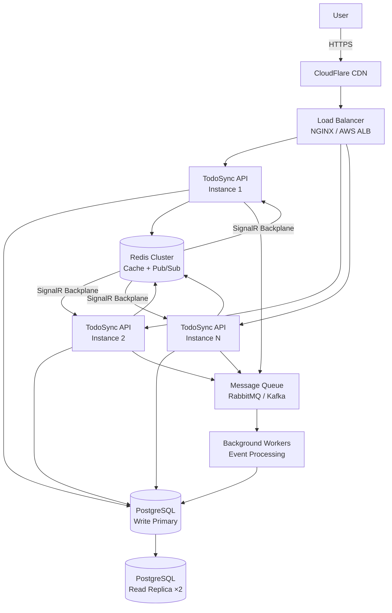
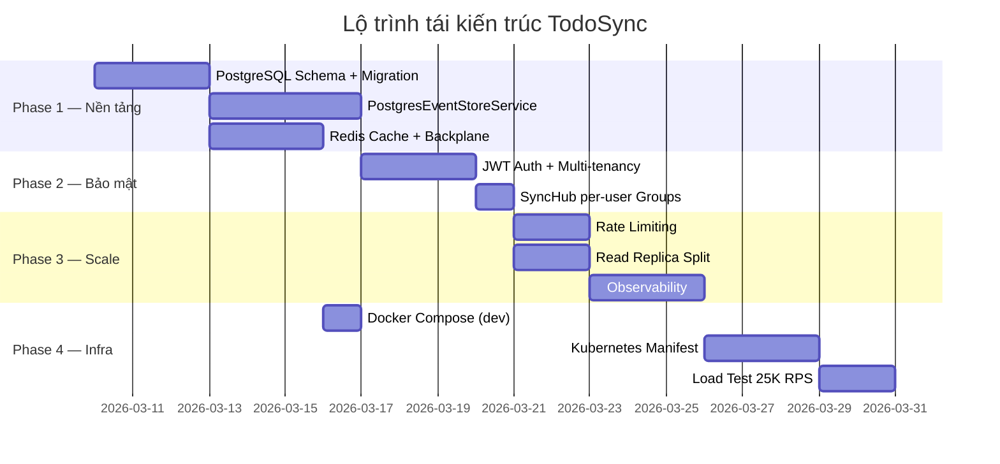

# Kế Hoạch Tái Kiến Trúc TodoSync — Scale 150 Triệu Người Dùng

> **Phạm vi:** Backend (chi tiết + code mẫu) · Frontend (hướng dẫn tổng quan) · Infrastructure (sơ đồ)

---

## Phân Tích Tải Ước Tính

| Chỉ số | Tính toán | Kết quả |
|---|---|---|
| Tổng user | 150M | 150,000,000 |
| DAU (10%) | 150M × 10% | 15,000,000 / ngày |
| Peak concurrent | DAU × 5% | 750,000 users cùng lúc |
| Requests/giây (push avg) | 750K × 2 req/phút / 60 | ~25,000 RPS |
| SignalR connections | 750,000 websocket | ~750K connections |
| Data/event | ~500 bytes | ~12 GB/ngày writes |

> [!IMPORTANT]
> Kiến trúc hiện tại (SemaphoreSlim + in-memory + file JSON) chỉ chịu được **~200 RPS** trên 1 instance. Phải tái kiến trúc hoàn toàn.

---

## Sơ Đồ Kiến Trúc Đích



---

## Đầu Mục 1: Thay Thế In-Memory Store → PostgreSQL + Redis

### So Sánh

| Tiêu chí | Hiện tại (file JSON) | PostgreSQL + Redis |
|---|---|---|
| Throughput | ~200 RPS | 50,000+ RPS |
| Concurrent writes | 1 (SemaphoreSlim) | Nhiều instance |
| Durability | Mất nếu file corrupt | ACID, WAL replication |
| Scale | Vertical only | Horizontal + Read replica |
| Startup time | Load file (~100ms) | Kết nối pool sẵn |
| Cost | $0 | Trung bình ($50-200/tháng self-host) |

### Schema PostgreSQL

```sql
-- Migration 001_init.sql

CREATE TABLE todo_items (
    id          TEXT        PRIMARY KEY,
    user_id     TEXT        NOT NULL,
    title       TEXT        NOT NULL,
    priority    TEXT        NOT NULL DEFAULT 'MEDIUM',
    day_key     DATE        NOT NULL,
    sort_order  INT         NOT NULL DEFAULT 0,
    completed   BOOLEAN     NOT NULL DEFAULT FALSE,
    deleted     BOOLEAN     NOT NULL DEFAULT FALSE,
    created_at  BIGINT      NOT NULL,
    updated_at  BIGINT      NOT NULL
);

CREATE INDEX idx_todo_user_updated ON todo_items (user_id, updated_at DESC);
CREATE INDEX idx_todo_user_day     ON todo_items (user_id, day_key);

CREATE TABLE todo_events (
    event_id    TEXT        PRIMARY KEY,
    user_id     TEXT        NOT NULL,
    todo_id     TEXT        NOT NULL,
    type        TEXT        NOT NULL,
    payload     JSONB,
    created_at  BIGINT      NOT NULL,
    server_at   BIGINT      NOT NULL DEFAULT EXTRACT(EPOCH FROM NOW()) * 1000
);

CREATE INDEX idx_event_user_server ON todo_events (user_id, server_at DESC);
```

### IEventStoreService mới (PostgreSQL)

```csharp
// Services/PostgresEventStoreService.cs
using Dapper;
using Npgsql;
using System.Text.Json;

public sealed class PostgresEventStoreService : IEventStoreService
{
    private readonly NpgsqlDataSource _db;
    private readonly IRedisService _redis;
    private readonly ILogger<PostgresEventStoreService> _logger;

    public PostgresEventStoreService(
        NpgsqlDataSource db,
        IRedisService redis,
        ILogger<PostgresEventStoreService> logger)
    {
        _db = db;
        _redis = redis;
        _logger = logger;
    }

    public async Task<IReadOnlyList<string>> AppendEventsAsync(
        string userId,
        IEnumerable<TodoEvent> events,
        CancellationToken ct = default)
    {
        var accepted = new List<string>();
        var ordered  = events.OrderBy(e => e.CreatedAt).ToList();

        await using var conn = await _db.OpenConnectionAsync(ct);
        await using var tx   = await conn.BeginTransactionAsync(ct);

        try
        {
            foreach (var e in ordered)
            {
                if (string.IsNullOrWhiteSpace(e.EventId) ||
                    string.IsNullOrWhiteSpace(e.TodoId)  ||
                    string.IsNullOrWhiteSpace(e.Type))
                    continue;

                // Idempotency: INSERT ... ON CONFLICT DO NOTHING
                var inserted = await conn.ExecuteAsync("""
                    INSERT INTO todo_events (event_id, user_id, todo_id, type, payload, created_at, server_at)
                    VALUES (@EventId, @UserId, @TodoId, @Type, @Payload::jsonb, @CreatedAt, @ServerAt)
                    ON CONFLICT (event_id) DO NOTHING
                    """,
                    new {
                        e.EventId,
                        UserId   = userId,
                        e.TodoId,
                        e.Type,
                        Payload  = e.Payload?.GetRawText(),
                        e.CreatedAt,
                        ServerAt = DateTimeOffset.UtcNow.ToUnixTimeMilliseconds()
                    }, tx);

                if (inserted > 0)
                    await ApplyAsync(conn, tx, userId, e, ct);

                accepted.Add(e.EventId);
            }

            await tx.CommitAsync(ct);

            // Invalidate read cache
            await _redis.DeleteAsync($"todos:{userId}:*");
        }
        catch
        {
            await tx.RollbackAsync(ct);
            throw;
        }

        return accepted;
    }

    public async Task<IReadOnlyList<TodoItem>> PullTodosSinceAsync(
        string userId,
        long since,
        CancellationToken ct = default)
    {
        // Try Redis cache first (short TTL for freshness)
        var cacheKey = $"todos:{userId}:since:{since}";
        var cached   = await _redis.GetAsync<List<TodoItem>>(cacheKey);
        if (cached is not null) return cached;

        await using var conn = await _db.OpenConnectionAsync(ct);
        var rows = (await conn.QueryAsync<TodoItem>("""
            SELECT id, title, priority, day_key as DayKey, sort_order as SortOrder,
                   completed, deleted, created_at as CreatedAt, updated_at as UpdatedAt
            FROM todo_items
            WHERE user_id = @UserId AND updated_at >= @Since
            ORDER BY updated_at DESC
            """,
            new { UserId = userId, Since = since })).ToList();

        await _redis.SetAsync(cacheKey, rows, TimeSpan.FromSeconds(5));
        return rows;
    }

    private static async Task ApplyAsync(
        NpgsqlConnection conn,
        NpgsqlTransaction tx,
        string userId,
        TodoEvent e,
        CancellationToken ct)
    {
        var now = Math.Max(DateTimeOffset.UtcNow.ToUnixTimeMilliseconds(), e.CreatedAt);

        switch (e.Type)
        {
            case "TODO_CREATED":
                var title    = e.ReadString("title") ?? "";
                var priority = e.ReadString("priority") ?? "MEDIUM";
                var dayKey   = e.ReadString("dayKey") ?? DateTime.UtcNow.ToString("yyyy-MM-dd");
                await conn.ExecuteAsync("""
                    INSERT INTO todo_items (id, user_id, title, priority, day_key, sort_order,
                                           completed, deleted, created_at, updated_at)
                    VALUES (@Id, @UserId, @Title, @Priority, @DayKey::date,
                            COALESCE((SELECT MAX(sort_order)+1 FROM todo_items
                                      WHERE user_id=@UserId AND day_key=@DayKey::date), 1),
                            false, false, @Now, @Now)
                    ON CONFLICT (id) DO NOTHING
                    """,
                    new { Id = e.TodoId, UserId = userId, Title = title,
                          Priority = priority, DayKey = dayKey, Now = now }, tx);
                break;

            case "TODO_TOGGLED":
                await conn.ExecuteAsync("""
                    UPDATE todo_items
                    SET completed = NOT completed, updated_at = @Now
                    WHERE id = @Id AND user_id = @UserId
                    """,
                    new { Id = e.TodoId, UserId = userId, Now = now }, tx);
                break;

            case "TODO_RENAMED":
                await conn.ExecuteAsync("""
                    UPDATE todo_items
                    SET title    = COALESCE(@Title, title),
                        priority = COALESCE(@Priority, priority),
                        updated_at = @Now
                    WHERE id = @Id AND user_id = @UserId
                    """,
                    new { Id = e.TodoId, UserId = userId,
                          Title    = e.ReadString("title"),
                          Priority = e.ReadString("priority"),
                          Now = now }, tx);
                break;

            case "TODO_DELETED":
                await conn.ExecuteAsync("""
                    UPDATE todo_items SET deleted = true, updated_at = @Now
                    WHERE id = @Id AND user_id = @UserId
                    """,
                    new { Id = e.TodoId, UserId = userId, Now = now }, tx);
                break;

            case "TODO_REORDERED":
                var orderedIds = e.ReadStringArray("orderedIds");
                var reorderDay = e.ReadString("dayKey");
                if (orderedIds is null || reorderDay is null) break;
                for (int i = 0; i < orderedIds.Count; i++)
                {
                    await conn.ExecuteAsync("""
                        UPDATE todo_items
                        SET sort_order = @Order, updated_at = @Now
                        WHERE id = @Id AND user_id = @UserId
                        """,
                        new { Id = orderedIds[i], UserId = userId, Order = i + 1, Now = now }, tx);
                }
                break;
        }
    }
}
```

---

## Đầu Mục 2: Authentication & Multi-Tenancy (JWT)

### So Sánh

| Tiêu chí | Hiện tại (không có auth) | JWT + Refresh Token |
|---|---|---|
| Bảo mật | 0 — ai cũng push/pull được | Token ký bởi server |
| Multi-user | Không | Mỗi user tách biệt |
| Revoke session | Không | Revoke qua Redis blacklist |
| Overhead | 0ms | ~0.5ms verify |

### Code: JWT Middleware

```csharp
// Program.cs — thêm auth
builder.Services
    .AddAuthentication(JwtBearerDefaults.AuthenticationScheme)
    .AddJwtBearer(opt =>
    {
        opt.TokenValidationParameters = new TokenValidationParameters
        {
            ValidateIssuer           = true,
            ValidateAudience         = true,
            ValidateLifetime         = true,
            ValidateIssuerSigningKey = true,
            ValidIssuer              = builder.Configuration["Jwt:Issuer"],
            ValidAudience            = builder.Configuration["Jwt:Audience"],
            IssuerSigningKey         = new SymmetricSecurityKey(
                Encoding.UTF8.GetBytes(builder.Configuration["Jwt:Secret"]!)),
            ClockSkew                = TimeSpan.FromSeconds(30),
        };

        // Cho phép SignalR đọc token từ query string
        opt.Events = new JwtBearerEvents
        {
            OnMessageReceived = ctx =>
            {
                var token = ctx.Request.Query["access_token"];
                if (!string.IsNullOrEmpty(token) &&
                    ctx.HttpContext.Request.Path.StartsWithSegments("/hubs"))
                    ctx.Token = token;
                return Task.CompletedTask;
            }
        };
    });
builder.Services.AddAuthorization();

// Endpoint push — lấy userId từ claim
app.MapPost("/api/sync/push", [Authorize] async (
    SyncPushRequest request,
    ClaimsPrincipal user,
    IEventStoreService store,
    IHubContext<SyncHub> hub,
    CancellationToken ct) =>
{
    var userId   = user.FindFirstValue(ClaimTypes.NameIdentifier)!;
    var accepted = await store.AppendEventsAsync(userId, request.Events, ct);

    // Chỉ notify đúng user, không broadcast all
    await hub.Clients.Group(userId).SendAsync("todosChanged", new { serverTime = DateTimeOffset.UtcNow.ToUnixTimeMilliseconds() }, ct);

    return Results.Ok(new SyncPushResponse { AcceptedEventIds = accepted.ToList() });
}).RequireAuthorization();
```

### SyncHub với Group per User

```csharp
// Hubs/SyncHub.cs
public sealed class SyncHub : Hub
{
    public override async Task OnConnectedAsync()
    {
        var userId = Context.User?.FindFirstValue(ClaimTypes.NameIdentifier);
        if (userId is not null)
            await Groups.AddToGroupAsync(Context.ConnectionId, userId);
        await base.OnConnectedAsync();
    }

    public override async Task OnDisconnectedAsync(Exception? exception)
    {
        var userId = Context.User?.FindFirstValue(ClaimTypes.NameIdentifier);
        if (userId is not null)
            await Groups.RemoveFromGroupAsync(Context.ConnectionId, userId);
        await base.OnDisconnectedAsync(exception);
    }
}
```

---

## Đầu Mục 3: Horizontal Scaling — Stateless API

### Vấn đề hiện tại

`SemaphoreSlim(1,1)` + `Dictionary _todos` trong memory = **stateful singleton** → chỉ 1 instance.

### Giải pháp: Hoàn toàn stateless

```csharp
// Program.cs
// TRƯỚC: builder.Services.AddSingleton<IEventStoreService, EventStoreService>();
// SAU:
builder.Services.AddScoped<IEventStoreService, PostgresEventStoreService>();

// Thêm connection pool
var connStr = builder.Configuration.GetConnectionString("Postgres")!;
builder.Services.AddNpgsqlDataSource(connStr, b =>
    b.MaxPoolSize(200).MinPoolSize(10));
```

### So Sánh Scale Strategy

| Chiến lược | Throughput | Chi phí | Độ phức tạp |
|---|---|---|---|
| Vertical (RAM/CPU) | 2-4× | Cao, giới hạn | Thấp |
| Horizontal (nhiều instance) | Tuyến tính | Trung bình | Trung bình |
| Horizontal + Read Replica DB | 5-10× hơn | Cao hơn | Cao |
| **Khuyến nghị** | Horizontal + Read Replica | — | — |

### Read/Write Splitting với Dapper

```csharp
// Infrastructure/DatabaseFactory.cs
public interface IDatabaseFactory
{
    Task<NpgsqlConnection> GetWriteConnectionAsync(CancellationToken ct);
    Task<NpgsqlConnection> GetReadConnectionAsync(CancellationToken ct);
}

public sealed class DatabaseFactory : IDatabaseFactory
{
    private readonly NpgsqlDataSource _write;
    private readonly NpgsqlDataSource _read;

    public DatabaseFactory(IConfiguration cfg)
    {
        _write = NpgsqlDataSource.Create(cfg.GetConnectionString("PostgresWrite")!);
        _read  = NpgsqlDataSource.Create(cfg.GetConnectionString("PostgresRead")!);
    }

    public Task<NpgsqlConnection> GetWriteConnectionAsync(CancellationToken ct)
        => _write.OpenConnectionAsync(ct).AsTask();

    public Task<NpgsqlConnection> GetReadConnectionAsync(CancellationToken ct)
        => _read.OpenConnectionAsync(ct).AsTask();
}

// appsettings.json
{
  "ConnectionStrings": {
    "PostgresWrite": "Host=pg-primary;Database=todosync;Username=app;Password=xxx",
    "PostgresRead":  "Host=pg-replica;Database=todosync;Username=app_ro;Password=xxx"
  }
}
```

---

## Đầu Mục 4: SignalR Scale-Out — Redis Backplane

### Vấn đề

Mỗi API instance có SignalR connection pool riêng. Client kết nối instance A sẽ **không nhận** notification khi instance B xử lý push.

### So Sánh Backplane

| Backplane | Latency | Throughput | Chi phí |
|---|---|---|---|
| Không có (hiện tại) | 0ms | Giới hạn 1 instance | $0 |
| Redis | ~1ms | 100K+ msg/s | $30-100/tháng |
| Azure SignalR Service | ~5ms | Unlimited (managed) | $50+/tháng theo đơn vị |
| **Khuyến nghị** | Redis | — | — |

```csharp
// Program.cs
builder.Services.AddSignalR()
    .AddStackExchangeRedis(
        builder.Configuration.GetConnectionString("Redis")!,
        opt => opt.Configuration.ChannelPrefix = RedisChannel.Literal("todosync"));
```

```xml
<!-- TodoSync.Api.csproj — thêm package -->
<PackageReference Include="Microsoft.AspNetCore.SignalR.StackExchangeRedis" Version="9.*" />
```

### Redis Service (Cache + Pub/Sub)

```csharp
// Infrastructure/RedisService.cs
using StackExchange.Redis;
using System.Text.Json;

public interface IRedisService
{
    Task<T?> GetAsync<T>(string key);
    Task SetAsync<T>(string key, T value, TimeSpan ttl);
    Task DeleteAsync(string pattern);
}

public sealed class RedisService : IRedisService
{
    private readonly IDatabase _db;
    private readonly IServer  _server;

    public RedisService(IConnectionMultiplexer mux)
    {
        _db     = mux.GetDatabase();
        _server = mux.GetServers().First();
    }

    public async Task<T?> GetAsync<T>(string key)
    {
        var val = await _db.StringGetAsync(key);
        if (!val.HasValue) return default;
        return JsonSerializer.Deserialize<T>(val!);
    }

    public Task SetAsync<T>(string key, T value, TimeSpan ttl)
    {
        var json = JsonSerializer.Serialize(value);
        return _db.StringSetAsync(key, json, ttl);
    }

    public async Task DeleteAsync(string pattern)
    {
        // Dùng SCAN thay vì KEYS để không block Redis
        await foreach (var key in _server.KeysAsync(pattern: pattern))
            await _db.KeyDeleteAsync(key);
    }
}
```

---

## Đầu Mục 5: Rate Limiting & Throttling

### So Sánh

| Chiến lược | Độ chính xác | Distributed | Độ phức tạp |
|---|---|---|---|
| Fixed Window | Thấp (burst đầu window) | Cần Redis | Thấp |
| Sliding Window | Cao | Cần Redis | Trung bình |
| Token Bucket | Cao, burst-friendly | Cần Redis | Trung bình |
| **Khuyến nghị** | Token Bucket per User | Redis | Trung bình |

```csharp
// Program.cs — .NET 7+ built-in rate limiter
using System.Threading.RateLimiting;

builder.Services.AddRateLimiter(opt =>
{
    opt.AddPolicy("sync-push", ctx =>
    {
        var userId = ctx.User?.FindFirstValue(ClaimTypes.NameIdentifier) ?? ctx.Connection.RemoteIpAddress?.ToString() ?? "anon";
        return RateLimitPartition.GetTokenBucketLimiter(userId, _ => new TokenBucketRateLimiterOptions
        {
            TokenLimit             = 60,   // 60 pushes burst
            TokensPerPeriod        = 30,   // refill 30 mỗi phút
            ReplenishmentPeriod    = TimeSpan.FromMinutes(1),
            QueueProcessingOrder   = QueueProcessingOrder.OldestFirst,
            QueueLimit             = 5,
        });
    });

    opt.AddPolicy("sync-pull", ctx =>
    {
        var userId = ctx.User?.FindFirstValue(ClaimTypes.NameIdentifier) ?? "anon";
        return RateLimitPartition.GetSlidingWindowLimiter(userId, _ => new SlidingWindowRateLimiterOptions
        {
            PermitLimit          = 120,
            Window               = TimeSpan.FromMinutes(1),
            SegmentsPerWindow    = 6,
            QueueProcessingOrder = QueueProcessingOrder.OldestFirst,
            QueueLimit           = 0,
        });
    });

    opt.OnRejected = async (ctx, ct) =>
    {
        ctx.HttpContext.Response.StatusCode = 429;
        ctx.HttpContext.Response.Headers.RetryAfter =
            ctx.Lease.TryGetMetadata(MetadataName.RetryAfter, out var retry)
                ? retry.TotalSeconds.ToString()
                : "60";
        await ctx.HttpContext.Response.WriteAsJsonAsync(new { error = "Too many requests" }, ct);
    };
});

// Áp dụng vào endpoint
app.MapPost("/api/sync/push", ...).RequireRateLimiting("sync-push");
app.MapGet("/api/sync/pull",  ...).RequireRateLimiting("sync-pull");
```

---

## Đầu Mục 6: CQRS Path — Pull từ Read Replica + Cache

### Kiến trúc

```
Write path: Client → API → PostgreSQL Primary → (async) Read Replica
Read  path: Client → API → Redis Cache (TTL 5s) → Read Replica nếu cache miss
```

### Pull Endpoint tối ưu với Cache-Aside

```csharp
app.MapGet("/api/sync/pull", [Authorize] async (
    long? since,
    ClaimsPrincipal user,
    IEventStoreService store,
    IRedisService redis,
    CancellationToken ct) =>
{
    var userId     = user.FindFirstValue(ClaimTypes.NameIdentifier)!;
    var sinceValue = since ?? 0;
    var cacheKey   = $"pull:{userId}:{sinceValue}";

    var cached = await redis.GetAsync<SyncPullResponse>(cacheKey);
    if (cached is not null)
        return Results.Ok(cached);

    var todos      = await store.PullTodosSinceAsync(userId, sinceValue, ct);
    var maxUpdated = todos.Count > 0 ? todos.Max(x => x.UpdatedAt) : sinceValue;
    var response   = new SyncPullResponse
    {
        Todos      = todos.ToList(),
        ServerTime = Math.Max(sinceValue, maxUpdated),
    };

    // Cache ngắn để tránh thundering herd sau SignalR broadcast
    await redis.SetAsync(cacheKey, response, TimeSpan.FromSeconds(3));
    return Results.Ok(response);
}).RequireAuthorization().RequireRateLimiting("sync-pull");
```

---

## Đầu Mục 7: Observability — Logging, Metrics, Tracing

### Stack

| Thành phần | Tool | Vai trò |
|---|---|---|
| Structured Logging | Serilog + Seq | Debug, search log |
| Metrics | OpenTelemetry + Prometheus | RPS, latency, error rate |
| Tracing | OpenTelemetry + Jaeger | Request tracing phân tán |
| Alerting | Grafana | Alert khi p99 > 500ms |

```csharp
// Program.cs — OpenTelemetry
builder.Services.AddOpenTelemetry()
    .WithTracing(b => b
        .AddAspNetCoreInstrumentation()
        .AddNpgsqlInstrumentation()
        .AddRedisInstrumentation()
        .AddOtlpExporter(o => o.Endpoint = new Uri("http://jaeger:4317")))
    .WithMetrics(b => b
        .AddAspNetCoreInstrumentation()
        .AddRuntimeInstrumentation()
        .AddPrometheusExporter());

app.MapPrometheusScrapingEndpoint("/metrics");
```

```csharp
// Structured log mỗi push
_logger.LogInformation(
    "Push accepted. UserId={UserId} EventCount={Count} DurationMs={DurationMs}",
    userId, accepted.Count, sw.ElapsedMilliseconds);
```

---

## Đầu Mục 8: Infrastructure — Kubernetes + CDN

### Kubernetes Deployment

```yaml
# k8s/deployment.yaml
apiVersion: apps/v1
kind: Deployment
metadata:
  name: todosync-api
spec:
  replicas: 10          # Scale ngang, tăng khi cần
  selector:
    matchLabels:
      app: todosync-api
  template:
    metadata:
      labels:
        app: todosync-api
    spec:
      containers:
      - name: api
        image: todosync-api:latest
        ports:
        - containerPort: 3000
        resources:
          requests: { cpu: "500m", memory: "256Mi" }
          limits:   { cpu: "2",    memory: "1Gi"   }
        env:
        - name: ConnectionStrings__PostgresWrite
          valueFrom:
            secretKeyRef: { name: db-secret, key: write-conn }
        - name: ConnectionStrings__Redis
          valueFrom:
            secretKeyRef: { name: redis-secret, key: conn }
        readinessProbe:
          httpGet: { path: /, port: 3000 }
          initialDelaySeconds: 5
          periodSeconds: 10
---
apiVersion: autoscaling/v2
kind: HorizontalPodAutoscaler
metadata:
  name: todosync-hpa
spec:
  scaleTargetRef:
    apiVersion: apps/v1
    kind: Deployment
    name: todosync-api
  minReplicas: 5
  maxReplicas: 100
  metrics:
  - type: Resource
    resource:
      name: cpu
      target: { type: Utilization, averageUtilization: 60 }
```

---

## Frontend — Hướng Dẫn Điều Chỉnh

> [!NOTE]
> Backend thay đổi contract (thêm auth, user-scoped), frontend cần cập nhật tương ứng.

| Điều chỉnh | Chi tiết |
|---|---|
| **Auth header** | Thêm `Authorization: Bearer <token>` vào mọi request push/pull |
| **SignalR auth** | Truyền token qua `?access_token=xxx` khi kết nối `/hubs/sync` |
| **Offline queue** | Giữ events trong IndexedDB, push khi có mạng (không thay đổi nhiều) |
| **Retry + backoff** | Khi nhận 429 (rate limit), đọc header `Retry-After` rồi wait |
| **Cursor pagination** | Pull v2 với `cursor` để không load toàn bộ nếu nhiều thay đổi |
| **Optimistic UI** | Apply event local ngay, rollback nếu server trả lỗi |

---

## Lộ Trình Thực Hiện



---

## Tóm Tắt Ưu Tiên

| # | Hạng mục | Tác động | Độ khẩn |
|---|---|---|---|
| 1 | PostgreSQL thay file JSON | 🔴 Critical | Ngay |
| 2 | Stateless API + Connection Pool | 🔴 Critical | Ngay |
| 3 | JWT Auth + Multi-tenant | 🔴 Critical | Ngay |
| 4 | Redis SignalR Backplane | 🟠 High | Tuần 1 |
| 5 | Rate Limiting | 🟠 High | Tuần 1 |
| 6 | Read Replica | 🟡 Medium | Tuần 2 |
| 7 | Observability | 🟡 Medium | Tuần 2 |
| 8 | Kubernetes + HPA | 🟡 Medium | Tuần 3 |
