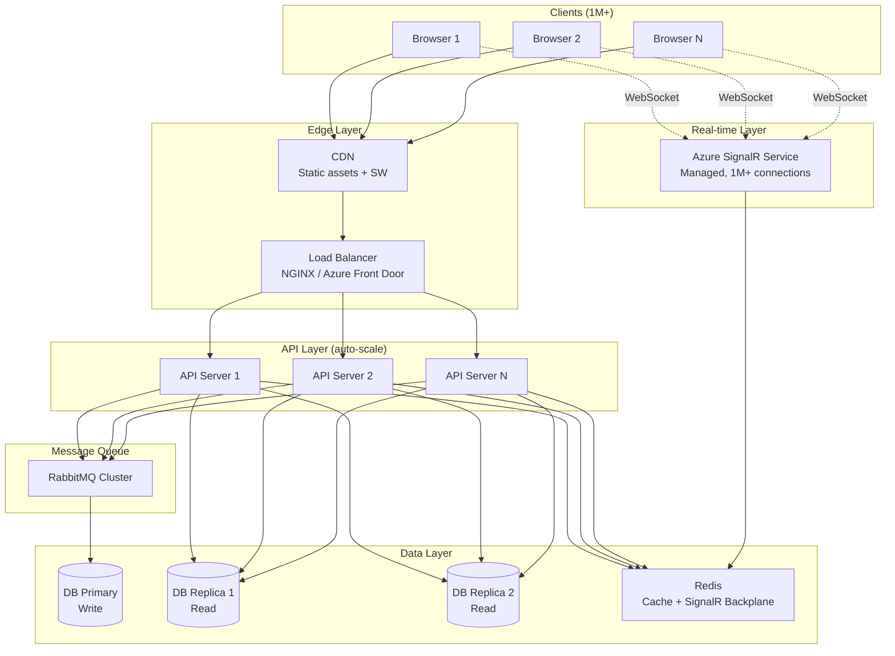

# 📋 Technology Review — TodoSync

## I. Tổng Quan Công Nghệ

### Frontend Framework

| Công nghệ | Version | Vai trò |
|-----------|---------|---------|
| **Angular** | 21.2 | Framework chính, standalone components |
| **TypeScript** | 5.9 | Type-safe development |
| **SCSS** | - | Styling |
| **Angular CDK** | 21.2 | Drag & Drop (reorder tasks) |

### State & Data

| Công nghệ | Version | Vai trò |
|-----------|---------|---------|
| **NgRx Store** | 21.0 | State management (RAM) — UI đọc từ đây |
| **NgRx Effects** | 21.0 | Side-effects orchestration |
| **Dexie.js** | 4.3 | IndexedDB wrapper — offline database (disk) |
| **Event Sourcing** | Custom | Ghi mọi thay đổi thành event → projection |

### Đồng Bộ & Real-time

| Công nghệ | Vai trò | Phạm vi |
|-----------|---------|---------|
| **SignalR** (v10) | WebSocket real-time từ server | Cross-device |
| **BroadcastChannel API** | Đồng bộ giữa các tab browser | Multi-tab |
| **localStorage event** | Fallback cho BroadcastChannel | Multi-tab |
| **REST API v2** (push/pull) | Sync dữ liệu qua HTTP | Client ↔ Server |
| **Network Detection** | `navigator.onLine` + event listener | Online/Offline |

### PWA & Deployment

| Công nghệ | Vai trò |
|-----------|---------|
| **Angular Service Worker** | Cache assets, offline capability |
| **GitHub Actions** | CI/CD pipeline |
| **Azure Web App** | Cloud hosting |

### Testing

| Công nghệ | Version | Vai trò |
|-----------|---------|---------|
| **Vitest** | 4.0 | Unit testing |
| **k6** | - | Load/stress testing (20K CCU) |

---

## II. Kỹ Thuật & Design Patterns

### 1. Event Sourcing
> **File:** [event-sourcing.service.ts](file:///d:/GitHub/todolist/src/app/core/services/event-sourcing.service.ts)

- Mọi thay đổi ghi thành **event** (`TODO_CREATED`, `TODO_TOGGLED`, `TODO_RENAMED`, `TODO_REORDERED`, `TODO_DELETED`)
- Event lưu vào bảng `events` (IndexedDB) → apply projection vào bảng `todos`
- Events chưa sync được đánh dấu `synced: 0`, push lên server khi có mạng

**Ưu điểm:** Audit trail, offline queue, conflict detection
**Nhược điểm:** Storage tăng dần (cần purge events cũ), phức tạp hơn CRUD đơn giản

### 2. CQRS (Command Query Responsibility Segregation)
> **File:** [sync-api.service.ts](file:///d:/GitHub/todolist/src/app/core/services/sync-api.service.ts)

- **Write path:** `POST /api/v2/sync/push` — đẩy events lên server
- **Read path:** `GET /api/v2/sync/pull` — kéo thay đổi về (phân trang + watermark)
- Tách biệt hoàn toàn giữa ghi và đọc

### 3. Optimistic UI
> **File:** [todo.effects.ts](file:///d:/GitHub/todolist/src/app/state/todo.effects.ts)

- UI cập nhật **ngay lập tức** khi user thao tác (ghi vào IndexedDB local)
- Sync với server chạy **background** — không block UI
- Nếu server reject → cần rollback (hiện chưa implement)

### 4. Offline-First
> **Files:** [app-db.service.ts](file:///d:/GitHub/todolist/src/app/infrastructure/db/app-db.service.ts), [sync.service.ts](file:///d:/GitHub/todolist/src/app/core/services/sync.service.ts)

- Dữ liệu lưu trong IndexedDB — app hoạt động không cần mạng
- Events queue lại khi offline, tự push khi online trở lại
- Service Worker cache assets cho PWA
- `window.addEventListener('online')` trigger sync ngay khi có mạng

### 5. Incremental Sync với Watermark
> **File:** [sync.service.ts](file:///d:/GitHub/todolist/src/app/core/services/sync.service.ts)

- Dùng `lastChangeId` (UUID watermark) để biết đã sync đến đâu
- Pull phân trang (`limit: 300`, có `cursor`) — không tải toàn bộ DB
- Full sync reconciliation: so sánh local vs server, xóa bản ghi stale
- Sync version check (`SYNC_VERSION = '2'`) — force reset khi schema đổi

### 6. Dual Store (NgRx + Dexie)
> **Files:** `state/*.ts` + `infrastructure/db/app-db.service.ts`

- **Dexie** = source of truth (disk, persist)
- **NgRx Store** = read cache (RAM, mất khi refresh)
- Data flow: Dexie → `getAllTodos()` → `dispatch(loadSuccess)` → NgRx → UI

> [!WARNING]
> **Hai kho chứa cùng dữ liệu** — phải dispatch `load()` thủ công ở nhiều nơi để đồng bộ. `liveQuery` đã viết sẵn nhưng chưa dùng — nếu dùng có thể bỏ NgRx, giảm phức tạp đáng kể.

### 7. Multi-tab Sync
> **File:** [tab-realtime.service.ts](file:///d:/GitHub/todolist/src/app/core/services/tab-realtime.service.ts)

- `BroadcastChannel('todo-sync-channel')` — API chuẩn browser, nhanh
- Fallback: `localStorage` event cho browser không hỗ trợ
- Khi 1 tab thay đổi → broadcast → các tab khác dispatch `load()`

### 8. Real-time Cross-Device
> **File:** [realtime-sync.service.ts](file:///d:/GitHub/todolist/src/app/core/services/realtime-sync.service.ts)

- SignalR Hub tại `/hubs/sync`
- Auto-reconnect: `[0, 1000, 3000, 5000]ms`
- Khi nhận `'todosChanged'` → trigger full sync
- Fallback retry mỗi 5 giây khi connection đứt

---

## III. Đánh Giá Kiến Trúc

### Điểm mạnh

| # | Điểm mạnh | Giải thích |
|---|-----------|------------|
| 1 | **Offline-first hoàn chỉnh** | Hoạt động không cần mạng, queue events, auto-sync |
| 2 | **Event Sourcing** | Audit trail, replay, sync protocol rõ ràng |
| 3 | **Multi-layer realtime** | SignalR (cross-device) + BroadcastChannel (multi-tab) |
| 4 | **Incremental sync** | Watermark + pagination, không full-reload |
| 5 | **PWA ready** | Service Worker, installable |

### Điểm yếu

| # | Điểm yếu | Ảnh hưởng |
|---|-----------|-----------|
| 1 | **Dual store (NgRx + Dexie)** | Duplicate state, phải sync thủ công, dễ lệch |
| 2 | **Không có conflict resolution** | Last-write-wins — có thể mất data khi 2 user sửa cùng lúc |
| 3 | **Không có rollback** | Nếu server reject event, UI đã hiển thị sai |
| 4 | **Event log không purge** | Bảng events tăng mãi, ảnh hưởng performance |
| 5 | **Single component** | Toàn bộ UI trong 1 component (`App`) — khó maintain khi mở rộng |

---

## IV. Khả Năng Scale — Triệu Người Dùng

### Đánh giá từng thành phần

| Thành phần | 1K CCU | 10K CCU | 100K CCU | 1M CCU | Đánh giá |
|-----------|--------|---------|----------|--------|----------|
| **Dexie (IndexedDB)** | ✅ | ✅ | ✅ | ✅ | Local, không ảnh hưởng bởi số user |
| **NgRx Store** | ✅ | ✅ | ✅ | ✅ | RAM local, không ảnh hưởng |
| **BroadcastChannel** | ✅ | ✅ | ✅ | ✅ | Local, zero server load |
| **Service Worker** | ✅ | ✅ | ✅ | ✅ | Giảm tải server (cached assets) |
| **REST API Push/Pull** | ✅ | ✅ | ⚠️ | ⚠️ | Stateless, scale bằng load balancer |
| **SignalR WebSocket** | ✅ | ✅ | ❌ | ❌ | **Bottleneck chính** |

### SignalR — Bottleneck Chính

> [!CAUTION]
> Mỗi WebSocket connection chiếm ~10-50KB RAM. 1 triệu connections = **10-50 GB RAM** chỉ riêng SignalR, chưa tính broadcast storm.

**Vấn đề cụ thể:**

| Vấn đề | Chi tiết |
|--------|---------|
| **Memory** | 1M connections × 50KB ≈ 50 GB RAM |
| **Broadcast storm** | 1 user thay đổi → broadcast 1M messages |
| **File descriptors** | Linux default 65K, cần kernel tuning |
| **Single point of failure** | 1 server SignalR chết = mất toàn bộ connections |

**Giải pháp:**

| Giải pháp | Mô tả | Scale |
|-----------|-------|-------|
| **Azure SignalR Service** | Managed service, tự scale | 1M+ connections |
| **Redis Backplane** | Nhiều server SignalR chia tải | 100K+ |
| **Topic/Group** | Chỉ broadcast trong group nhỏ | Giảm broadcast storm |
| **Chuyển sang SSE** | Server-Sent Events nhẹ hơn (one-way) | 500K+ trên single server |
| **Polling fallback** | Long-polling cho client yếu | Unlimited (stateless) |

### REST API — Scale Tốt Với Điều Kiện

| Yếu tố | Hiện tại | Cần cho 1M CCU |
|---------|----------|----------------|
| **Load Balancer** | Không có | ✅ NGINX/HAProxy |
| **Auto-scaling** | Azure single instance | ✅ Horizontal pod autoscaler |
| **Rate limiting** | Không có | ✅ Throttle per-user |
| **CDN** | Không có | ✅ Cache static assets |
| **Database** | Single instance | ✅ Read replicas + connection pooling |
| **Async writes** | RabbitMQ (đã có) | ✅ Giữ nguyên, tăng workers |

### Kiến trúc đề xuất cho 1M+ CCU

---

## V. Khuyến Nghị Cải Thiện

### Ưu tiên cao (Kiến trúc)

| # | Cải thiện | Lý do | Effort |
|---|-----------|-------|--------|
| 1 | **Bỏ NgRx, dùng liveQuery** | Loại bỏ dual store, code gọn hơn 40% | Medium |
| 2 | **CRDT thay last-write-wins** | Không mất data khi concurrent edit | High |
| 3 | **Purge old events** | Tránh IndexedDB phình | Low |
| 4 | **Optimistic rollback** | Xử lý khi server reject | Medium |

### Ưu tiên cao (Scale)

| # | Cải thiện | Lý do | Effort |
|---|-----------|-------|--------|
| 5 | **Azure SignalR Service** | Bỏ self-hosted, scale 1M+ | Low |
| 6 | **Rate limiting** | Chống abuse sync API | Low |
| 7 | **DB read replicas** | Scale read path | Medium |
| 8 | **CDN cho static assets** | Giảm tải origin server | Low |

### Ưu tiên trung bình (Code quality)

| # | Cải thiện | Lý do | Effort |
|---|-----------|-------|--------|
| 9 | **Tách App thành multiple components** | 1 component 222 dòng, khó maintain | Medium |
| 10 | **Error boundary + retry** | Xử lý lỗi sync gracefully | Low |
| 11 | **E2E testing** | Đảm bảo sync flow hoạt động | Medium |
